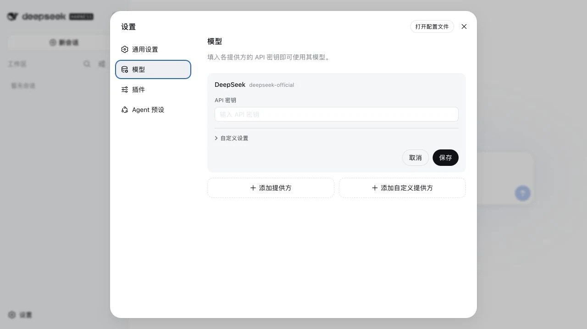
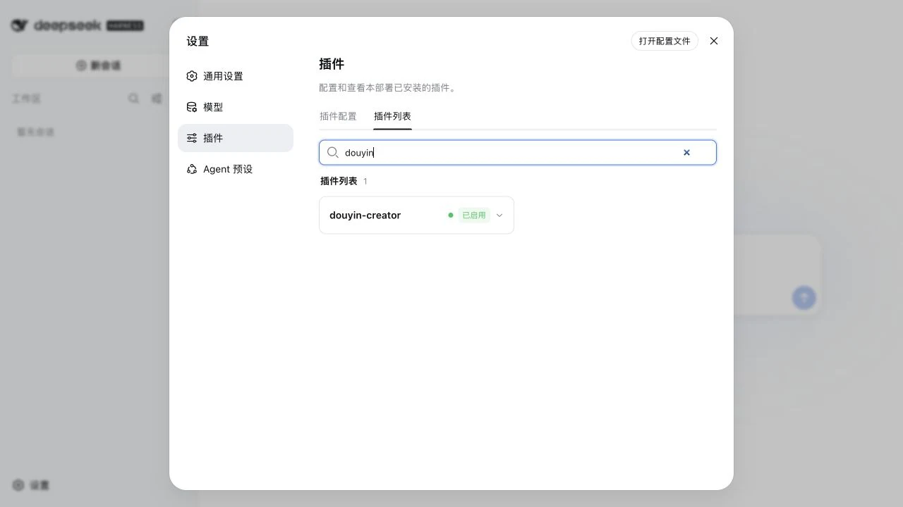
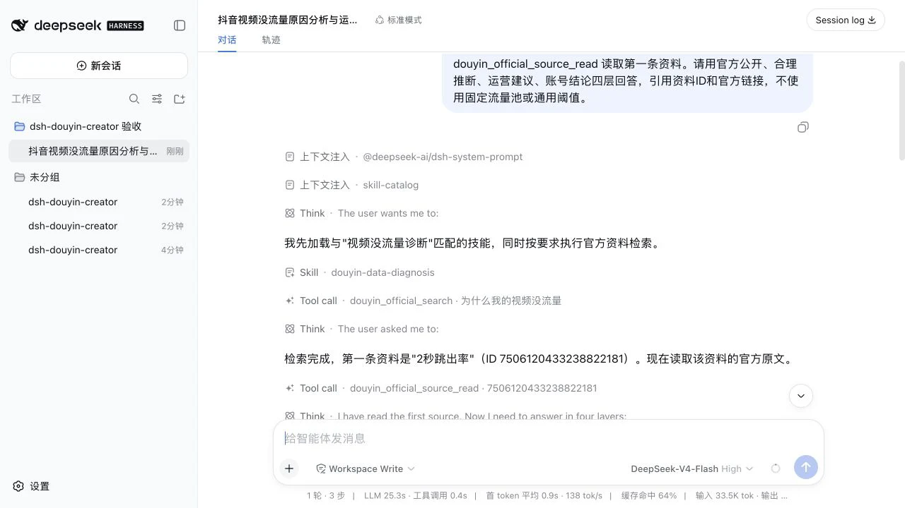
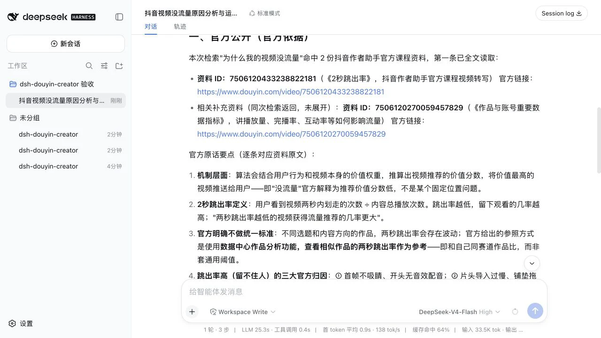
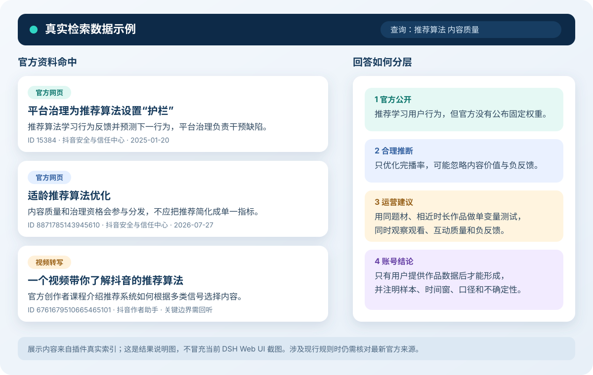

# 抖音官方资料创作助手：普通客户使用教程

这是一套给普通 Windows、macOS 用户使用的抖音创作辅助工具。你可以用自然语言问它“新账号该做什么”“视频为什么没流量”“这个选题能不能做”，它会先检索抖音官方公开资料，再把回答分成官方公开、合理推断、运营建议和账号结论。

它能减少“流量池等级”“统一账号权重”“万能发布时间”等未经官方证实的说法，但不能保证涨粉、播放量或收益。

## 一、安装前只准备两样东西

1. 解压完整的客户安装包。不要只单独复制其中一个安装文件。
2. 准备一个可用的模型 API Key。安装器不会读取、显示或修改它；第一次打开网页后再由你自己填写。

不需要提前安装 DSH、Node.js、Git 或开发工具，也不需要管理员权限。

## 二、Windows 一键安装

1. 解压客户安装包。
2. 双击根目录里的 `Windows-双击安装并启动.cmd`。
3. 保持黑色窗口打开。第一次安装依赖较多，弱网下可能需要 5 到 15 分钟。
4. 安装完成后，浏览器会自动打开 `http://127.0.0.1:3080/`。

如果 Windows 弹出安全提醒，只在安装包来自你信任的官方交付渠道时继续。安装器使用当前用户目录，不会调用 winget、Chocolatey 或管理员提权，也不会改全局 npm 镜像。

## 三、macOS 一键安装

1. 解压客户安装包。
2. 双击根目录里的 `macOS-双击安装并启动.command`。
3. 保持终端窗口打开。第一次安装依赖较多，弱网下可能需要 5 到 15 分钟。
4. 安装完成后，默认浏览器会自动打开 `http://127.0.0.1:3080/`。

若 macOS 首次阻止打开，请在 Finder 中按住 Control 点击该文件，选择“打开”，并确认文件确实来自你信任的交付渠道。安装器不会使用 `sudo`，便携 Node.js 会放在当前用户的“应用支持”目录。

## 四、弱网时它会做什么

安装器已经替你处理了最常见的网络问题：

- Node.js 先尝试官方地址，失败后自动尝试国内镜像；
- DSH 依赖先尝试 npm 官方源，失败后自动切换国内镜像；
- 所有下载和 npm 依赖都保留缓存，失败后重新双击不会完全重来；
- Node.js 压缩包会用官方校验清单做 SHA-256 校验；
- 插件直接从客户包本地安装，安装过程中不再访问 GitHub。

窗口每隔一段时间会提示仍在安装。不要因为短时间没有新文字就关闭它。如果两个软件源都不可用，先更换网络后再次双击；已完成的下载仍会复用。

## 五、第一次打开：配置模型

点击左下角“设置”，进入“模型”，把 API Key 填进对应服务商的输入框并保存。



请注意：

- 只在本机的模型设置页面填写 API Key；
- 不要把 API Key 发给客服、粘贴到对话内容或放进截图；
- 本插件和安装器都不会主动读取、显示或改写 API Key。

## 六、确认插件已经启用

进入“设置 → 插件 → 插件列表”，搜索 `douyin`。看到 `douyin-creator` 和绿色“已启用”即可。



如果没有看到它，关闭窗口后重新双击安装文件。安装结束前会自动运行环境自检，检查 Node.js、npm、73 份官方资料、插件安装和启用状态。

## 七、确认真实对话正在使用官方资料

配置模型后，新建会话并发送教程里的提问。正常情况下，对话过程会先出现 Skill，再出现 `douyin_official_search` 和 `douyin_official_source_read` 两个工具调用。



最终回答中应能看到资料 ID、抖音官方链接，以及“官方公开、合理推断、运营建议、账号结论”四层边界。



这两张图来自 2026-08-30 的隔离环境真实验收：DeepSeek-V4-Flash 实际完成了一轮数据诊断，调用了 Skill、官方检索和原文读取。测试用 API Key 只保存在本机隔离配置中，没有输入对话、写入项目或出现在截图里。

如果回答里完全没有工具调用或资料 ID，可以追加一句：

```text
请必须先调用 douyin_official_search 检索官方资料，
再调用 douyin_official_source_read 读取最相关原文后回答。
```

## 八、零基础用户的第一段提问

新建会话后，直接复制下面这段，把方括号里的内容换成自己的情况：

```text
请使用 douyin-creator-onboarding 帮我从零梳理账号。
我的方向是：[例如职场沟通]
想帮助的人是：[例如刚入职的年轻人]
账号阶段和最近10条数据：[新号，暂时没有数据]
我能稳定制作的形式：[真人口播，每周3条]
本月目标：[找到一个能持续做的选题方向]

请先检索抖音官方资料并读取最相关的原文，
再给我账号卡片、3个内容支柱、第一周3条最小可行作品，
最后把官方公开、合理推断、运营建议和账号结论分开。
```

这一步的目标不是一次定出“完美定位”，而是得到三条能立即拍、能比较、能复盘的作品。

## 九、四个最常用场景

### 1. 评估一个选题

```text
请用 douyin-topic-evaluation 评估这个选题：
“为什么越努力汇报，领导越听不进去？”
目标用户是工作1到3年的职场新人，视频计划60秒。
请先查官方资料，再给出值得做、不值得做或需要缩小的结论，
并写出开头、用户收益、搜索表达和事实风险。
```

### 2. 审查一篇脚本

```text
请用 douyin-script-review 审查下面的口播稿。
重点检查平台机制、数字、因果关系、绝对化承诺、封面和字幕，
发现问题时给出可以直接替换的句子。
[粘贴脚本]
```

### 3. 诊断播放低

```text
请用 douyin-data-diagnosis 诊断最近10条作品。
不要用统一的完播率或留存阈值，优先比较我账号自身、相近题材和相近时长。
数据字段：发布日期、题材、时长、播放、2秒跳出、平均播放时长、完播、搜索流量、点赞、评论、收藏、关注。
[粘贴数据]
```

一次只改变一个主要变量，例如开头表达、题材角度或视频时长。否则下一轮很难判断到底是什么产生了变化。

### 4. 制定一周计划

```text
请用 douyin-weekly-plan 给我做一周3条内容实验。
目标是：[例如提高职场新人收藏和关注]
可用时间：[每周6小时]
请写明每条作品的证据、假设、制作动作、观察指标和停止条件，
不要承诺播放量或涨粉结果。
```

## 十、看懂回答中的“证据卡”

检索结果会包含资料 ID、标题、发布者、时间、官方链接、命中词和证据摘要。



摘要只能帮助定位，重要结论还要读取上下文。你可以继续说：

```text
请用 douyin_official_source_read 读取资料 ID“刚才结果中的ID”，
从第1个切片开始读取2个切片，并说明原文直接支持什么、没有公开什么。
```

若资料是官方视频的机器转写，关键数字、否定词和规则边界还需要回听原视频，或用正式网页、公示和规则交叉核对。

## 十一、普通客户的复盘节奏

建议每周只做一次小复盘：

1. 选出同题材、相近时长的作品，不把完全不同的视频硬放在一起。
2. 先看账号自己的近期基线，再看本周的变化。
3. 记录本周只改变了哪个变量，以及结果是改善、持平还是变差。
4. 保留有效假设，停止连续两轮无改善的做法。
5. 有争议的热点、财经和人物内容，发布前再核对一手公告、财报、监管文件或政府通报。

## 十二、常见问题

**关闭黑色窗口或终端后，网页打不开了？** 这是正常的。窗口同时承载本地服务；重新双击安装文件即可启动。

**重复双击会不会装坏？** 安装流程可重复运行，会复用缓存并重新自检；它不会覆盖 API Key。

**一直停在“正在安装”？** 首次安装依赖较多。等待窗口的进度提示；超过 15 分钟仍没有成功或失败提示时，关闭后更换网络再试，缓存会保留。

**它为什么不给统一的完播率合格线？** 抖音公开资料没有给所有赛道、时长和账号阶段通用的固定合格线。应该和账号自身近期、相近题材及相近时长作品比较。

**资料是不是最新政策？** 当前离线资料快照采集于 2026-08-13 至 2026-08-14。涉及“今天、当前入口、现行政策、最新治理规则”时，必须继续核对最新官方网页。

**如何卸载？** 删除当前用户目录中的 `dsh-douyin-creator` 便携运行目录只会移除安装器缓存和便携 Node.js；DSH 的个人配置位于用户目录下的 `.dsh`。若其中还存有其他插件或会话，不要直接整目录删除，优先使用 DSH 的插件移除功能。

## 十三、适合交付给客户的方式

请把整个客户安装包作为一个 ZIP 交付，不要只发送双击文件。为了照顾无法访问 GitHub 的用户，可同时放在你的官网或常用网盘；安装过程本身已经不依赖 GitHub，并带官方源、国内镜像和断点式缓存回退。

建议客户第一次先完成“账号梳理 → 3条最小作品 → 一周复盘”，再逐步使用选题评估、脚本审查和数据诊断。这样更容易把工具变成稳定工作流，而不是一次性的问答机器人。
